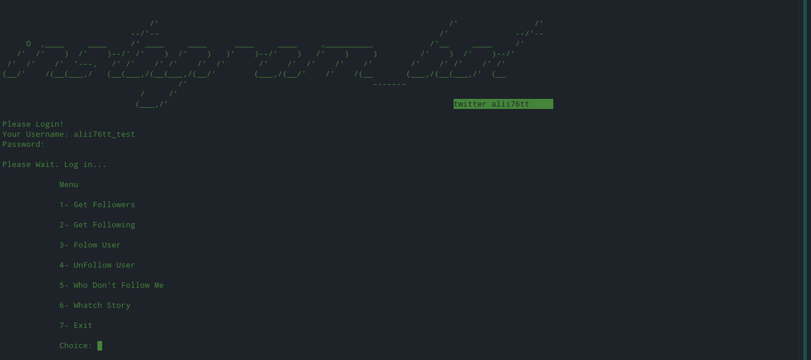

# python_instagram_bot
An Instagram bot that can do many things written in Python.

## Screenshot



## Video
[]
[](https://www.youtube.com/watch?v=K4SBRDJhn2I)

## Properties
* Sign In
* Get Followers
* Get Following
* Follow User (can do more than one)
* Unfollow User (can do more than one)
* Who Don't Follow Me
* Watch Story


## Getting Started

### Prerequisites

You will need the following for running this script-<br/>
>1)Python installed in your system<br/>
>2)Firefox web browser with Firefox webdriver<br/>
>3)pip<br/>
>4)selenium==3.141.0<br/>
>5)requests<br/>
>6)colorama==0.4.4<br/>

# Requirements
colorama==0.4.4
selenium==3.141.0

### Installation Instructions

#### 1) Installing Python
Site to download python https://www.python.org/downloads/

#### 2) Installing Firefox
```elm
cd
sudo apt-get -y install firefox
cd
wget https://github.com/mozilla/geckodriver/releases/download/v0.26.0/geckodriver-v0.26.0-linux64.tar.gz
tar xzf geckodriver-v0.26.0-linux64.tar.gz
sudo mv geckodriver /usr/bin/geckodriver
```

##### For Windows:

>1. Install [Firefox](https://www.mozilla.org/en-US/firefox/new/) <br>
>2. Download -> 32bit - [geckodriver](https://github.com/mozilla/geckodriver/releases/download/v0.29.1/geckodriver-v0.29.1-win32.zip), 64bit - [geckodriver](https://github.com/mozilla/geckodriver/releases/download/v0.29.1/geckodriver-v0.29.1-win64.zip) - Download the zip folder and extract it <br>
>3. Add the file present in the extracted folder to the path <br>
To add the file to path, paste it here (at this location) -> <br>
`C: -> Users -> <your_pc_name> -> AppData -> Local -> Programs -> Python -> Python<version_>`


# Installation

```sh
$ git clone https://github.com/alii76tt/python_instagram_bot
$ cd python_instagram_bot
$ pip install -r requirements.txt
$ python instagram.py
```
